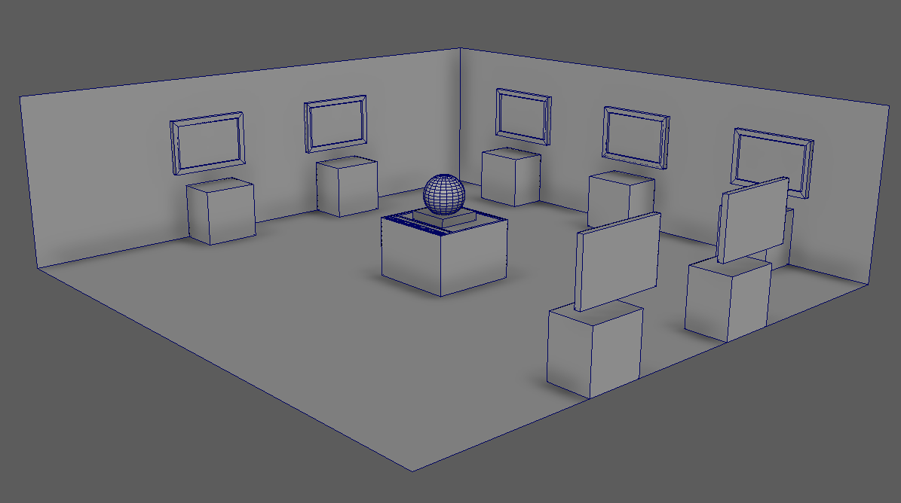
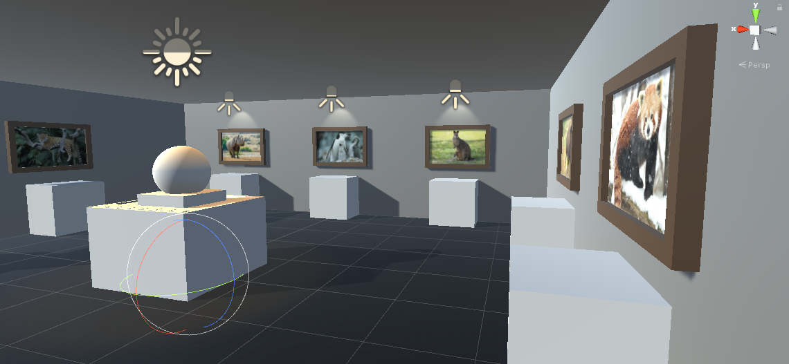

# VRProject-alexh

### Project description: 
The game consists of a small puzzle or riddle about different animal species and their primary natural habitat. 
The player is located in a small room. In the middle of the room there is a world globe and a table with name tags on it. The 7 continents of the earth can be taken from the globe in the form of a small plate. There are 7 different name tags and each of them has an animal written on them. On the walls of the room, there are also 7 pictures of those animals. There are sockets under each picture where the player can put something onto. The player's goal is to match the correct name tag and the correct continent platte to each of the animals. The player is doing this by putting the objects into the corresponding socket.  

  
Spoiler warning!

  
  Here are the animals that are used and what their primary natural habitat is.  
  North America: Buffalo  
  South America: Jaguar  
  Europe: Reindeer  
  Africa: Rhino  
  Asia: Red Panda  
  Australia: Wallaby  
  Antarctica:  Chinstrap penguin
  

### Additional Documentation
[Documentation as of March 18, 2020](https://github.com/5ahmnm1920-mep3-G3/VRProject-alexh/blob/master/Documentation/VRProject-alexh-documentation-18-03-2020.pdf/)

### Development platform: 
* OS: Windows 10 Version 1909
* Engine: Unity 2019.1.14f1
* IDE: Visual Studio Community 2019 Version 16.4.0
* Scripting Runtime Version: .NET 4.x Equivalent
* API Compatibility Level: .NET Standard 2.0

### Target platform: 
Virtual Reality with SteamVR (HTC Vive and Oculus Rift)

### Visuals: 
Greybox in Maya:

  
Room in Unity:

### Necessary setup/execution steps: 
For the best experience, the player needs a VR Device (Oculus Rift or HTC Vive). Alternatively, the player could use the 2D Debug mode to play the game on a normal 2D screen.

### Third party material: 
* 7 pictures of animals, which are used as textures in the game

### Project state: 
15%

### Limitations: 

### Lessons Learned: 

© by [Alexander Hoedlmoser](https://github.com/alexhoedlmoser/)
